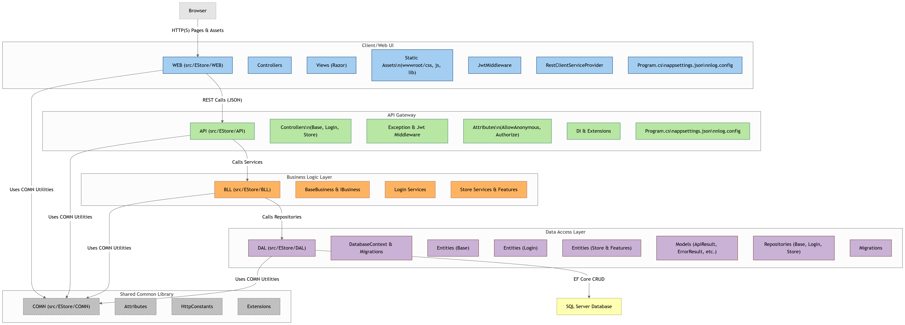

# e-store 🛍️

[](https://deepwiki.com/ahmadmdabit/e-store)
[](https://dotnet.microsoft.com/)
[](LICENSE.md)

## 📋 Table of Contents
- [Overview](#overview)
- [Architecture](#architecture)
- [Features](#features)
- [Diagram](#diagram)
- [Tech Stack](#tech-stack)
- [Getting Started](#getting-started)
  - [Prerequisites](#prerequisites)
  - [Installation](#installation)
  - [Running the Application](#running-the-application)
  - [Database Setup](#database-setup)
- [Project Structure](#project-structure)
- [API Documentation](#api-documentation)
- [License](#license)

## 📖 Overview

e-store is a full-featured e-commerce application built with modern .NET technologies. It follows an N-Tier architecture pattern with a clean separation of concerns, making it highly maintainable and scalable.

The application consists of two main components:
- **Backend API**: A RESTful web API with JWT authentication and Swagger documentation
- **Frontend Web**: An ASP.NET Core MVC application with Razor views for the user interface

## 🏗️ Architecture

The application follows a traditional N-Tier architecture pattern:

```
WEB (Frontend) ←→ API (Backend) ←→ BLL ←→ DAL ←→ Database
     ↑                                ↑
     └────────────────────────────────┘
                   COMN (Shared)
```

### Layers:
1. **COMN (Common Layer)**: Shared components, attributes, constants, and extensions
2. **DAL (Data Access Layer)**: Database operations using Entity Framework Core
3. **BLL (Business Logic Layer)**: Business logic implementation
4. **API (Backend)**: RESTful API with JWT authentication
5. **WEB (Frontend)**: MVC application with Razor views

## ✨ Features

- 🔐 **User Authentication**: Secure JWT-based authentication
- 🛒 **Shopping Cart**: Add/remove items, quantity management
- 📦 **Product Catalog**: Browse products with categories/brands
- 📝 **Order Processing**: Create and track orders
- 👤 **User Profiles**: Manage personal information
- 📊 **Admin Dashboard**: Product and category management
- 📱 **Responsive Design**: Mobile-friendly interface
- 📚 **API Documentation**: Interactive Swagger UI

## 📊 Diagram

[](https://gitdiagram.com/ahmadmdabit/e-store)



## 🧰 Tech Stack

| Layer | Technology |
|-------|------------|
| **Framework** | ASP.NET Core 6 |
| **Language** | C# |
| **Architecture** | N-Tier |
| **Authentication** | JWT Bearer Tokens |
| **Database** | SQL Server LocalDB (Entity Framework Core) |
| **Frontend** | ASP.NET Core MVC (Razor Views) |
| **API Documentation** | Swagger/OpenAPI |
| **Logging** | NLog |
| **Data Seeding** | Faker.NET |
| **HTTP Client** | RestSharp |

## 🚀 Getting Started

### Prerequisites

- [.NET 6 SDK](https://dotnet.microsoft.com/download/dotnet/6.0)
- SQL Server LocalDB (included with Visual Studio or [SQL Server Express](https://www.microsoft.com/en-us/sql-server/sql-server-downloads))

### Installation

1. Clone the repository:
   ```bash
   git clone https://github.com/ahmadmdabit/e-store.git
   cd e-store
   ```

2. Restore dependencies:
   ```bash
   dotnet restore
   ```

### Running the Application

#### Backend API
```bash
cd src\EStore\API
dotnet run
```
- **API Endpoint**: `https://localhost:7018` or `http://localhost:5018`
- **Swagger UI**: Available at `/swagger`

#### Frontend Web
```bash
cd src\EStore\WEB
dotnet run
```
- **Web Interface**: `https://localhost:7042` or `http://localhost:5042`

### Database Setup

The application uses SQL Server LocalDB with an attached MDF file:

- **Database file**: `API/App_Data/EStoreDatabase.mdf`
- **Connection string**: `Data Source=(LocalDB)\MSSQLLocalDB;AttachDbFilename=|DataDirectory|\EStoreDatabase.mdf;Integrated Security=True;Connect Timeout=30`

Entity Framework migrations will automatically create the database on first run.

## 📁 Project Structure

```
src\EStore\
├── API\           # RESTful API backend
├── BLL\           # Business Logic Layer
├── COMN\          # Common components
├── DAL\           # Data Access Layer
└── WEB\           # Web frontend (MVC)
```

## 📚 API Documentation

The API is documented using Swagger/OpenAPI. Once the API is running, you can access the interactive documentation at:

```
https://localhost:7001/swagger
```

The documentation provides:
- Complete endpoint list
- Request/response schemas
- Interactive testing interface
- JWT authentication support

## 📄 License

Licensed under the [MIT license](LICENSE.md).
